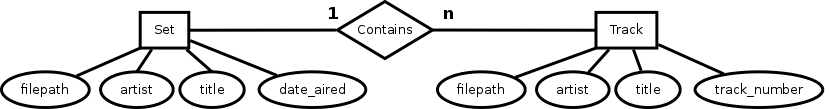

# App Name

TODO

# App Description

Downloads freely-available DJ sets from <http://www.livesets.us> and splits them using cuesheet files downloaded from <http://www.cuenation.com> to produce a searchable listing of DJ sets and split individual tracks (split with `mp3splt`) with download links to both the original DJ set file, the `.cue` file, and the split individual `.mp3` files.

# Data

## Entity-Relationship Diagram

## Models

`Set` attributes:

- `file_path`
- `artist`
- `title`
- `date_aired`

`Track` attributes:

- `file_path`
- `artist`
- `title`
- `track_number`

## Associations

`Track belongs_to Set`

# Features

## User Stories

### Will implement

TODO: Add acceptance criteria and task breakdown for every single user story.

- As a user, I want to have the option to download the full DJ set.
- As a user, I want to have the option to download the associated .CUE file.
- As a user, I want to have the option to download single tracks split from a DJ set.
- As a user, I want be see the tracklist of a set.
- As a user, I want to see pictures of the artist at shows they've previously played at.

### Might implement, time-permitting

- As a user, I want to be able to visit the SoundCloud page of an artist.
- As a user, I want to be able to visit the official website of an artist.
- As a user, I want to look up the lyrics for a song I like.

### Won't implement

- As a user, I want to be able to log in and out of the app.
- As a user, I want suggestions for new artists to explore, based on the music I previously listened to.
- As a user, I want to be able to resell tickets more reliably to a show if I can't make it.
- As a user, I want to be able to find out the ID of an "ID - ID" song.
- As a user, I want search for a higher quality version of the set.
- As a user, I want to keep a log of what I've listened to.
- As a user, I want to know what my actual friends are listening to.
- As a user, I want to know when I'm able to see an artist next, up to a year in advance by seeing their tour dates.

# Pages

Create a list of pages. 

For each page, mention:
- URL structure for the page
- a sentence or two describing what that page will have on it (a form, a list, details, something else? multiple things?)
- draw wireframe in detail, including navbar
- color scheme

## Home Page

TODO: Include photos of hand-sketches.

## Search Results Page

TODO: Include photos of hand-sketches.

## Set Page

# User flow 

1. User ...

# APIs and links

https://github.com/maurimiranda/image_suckr
Tracklists: http://www.1001tracklists.com
http://musicmachinery.com/music-apis/
http://docs.seattlerb.org/mechanize/
Tickets: https://github.com/bluefocus/seatgeek
Suggested artists from last.fm using gem
Lyrics gem: https://github.com/pilu/musix_match
