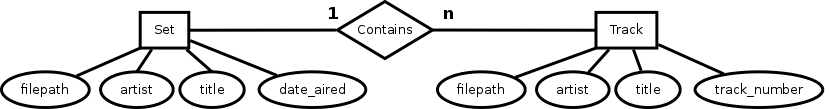
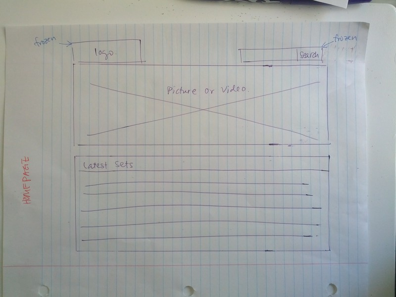
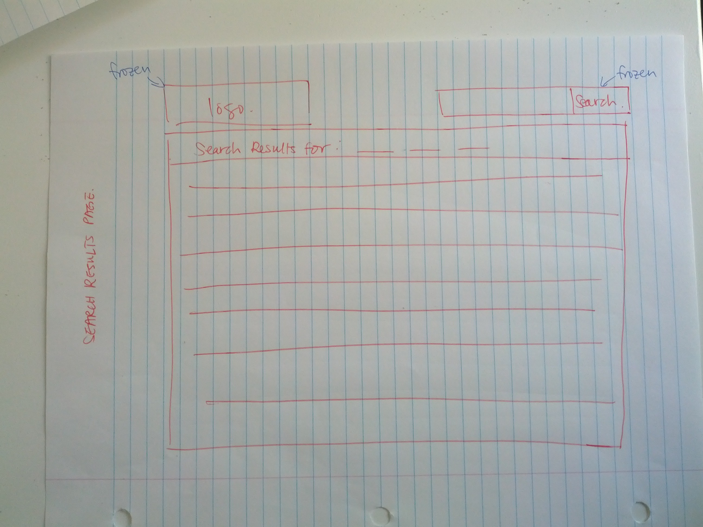
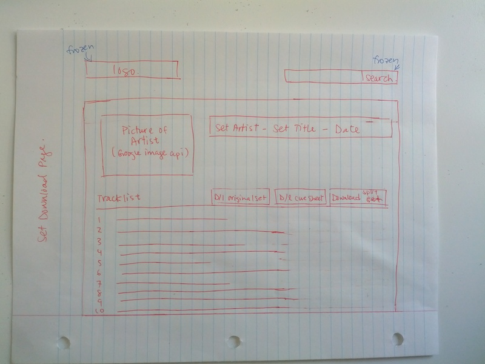

# App Name

TODO

# App Description

Downloads freely-available DJ sets from <http://www.livesets.us> and splits them using cuesheet files downloaded from <http://www.cuenation.com> to produce a searchable listing of DJ sets and split individual tracks (split with `mp3splt`) with download links to both the original DJ set file, the `.cue` file, and the split individual `.mp3` files.

# Data

- Development database: sqlite3
- Production database: mysql

## Entity-Relationship Diagram

## Models

`Set` model's attributes:

- `file_path`
- `artist`
- `title`
- `date_aired`

`Track` model's attributes:

- `file_path`
- `artist`
- `title`
- `track_number`

## Associations

One-to-many association between: `Set` and `Track`

# Frameworks and Tools

Server:

- Amazon EC2 running Ubuntu 12.04.4 LTS

Backend downloader:

- https://github.com/sparklemotion/mechanize
- http://mp3splt.sourceforge.net/
- https://github.com/jmettraux/rufus-scheduler/
- https://github.com/moumar/ruby-mp3info

Backend web app:

- Sinatra
- Active Record
- https://github.com/maurimiranda/image_suckr

Frontend:

- http://getbootstrap.com/

# Features

## User stories we will implement

- As a user, I want to be able to search for DJ sets to download.
- As a user, I want to be able to search for single tracks to download.
- As a user, I want to have the option to download the full DJ set.
- As a user, I want to have the option to download the associated cuesheet file for a DJ set.
- As a user, I want to have the option to download single tracks split from a DJ set.
- As a user, I want be see the tracklist of a DJ set if a cuesheet file exists.
- As a user, I want to see pictures of the artist at shows they've previously played at.

## User stories we might implement, time-permitting

- As a user, I want be see the tracklist of a DJ set retrieved from <http://www.1001tracklists.com> if a cuesheet file doesn't exist.
- As a user, I want to be able to visit the SoundCloud page of an artist.
- As a user, I want to be able to visit the official website of an artist.
- As a user, I want to look up the lyrics for a song I like.

## User stories we won't implement

- As a user, I want to be able to log in and out of the app.
- As a user, I want suggestions for new artists to explore, based on the music I previously listened to.
- As a user, I want to be able to resell tickets more reliably to a show if I can't make it.
- As a user, I want to be able to find out the ID of an "ID - ID" song.
- As a user, I want search for a higher quality version of the set.
- As a user, I want to keep a log of what I've listened to.
- As a user, I want to know what my actual friends are listening to.
- As a user, I want to know when I'm able to see an artist next, up to a year in advance by seeing their tour dates.

# Pages and Wireframes

## Home Page

URL: `/`

Content:

- frozen navbar at top with logo and search box (same on all pages)
- large picture or video
- list of latest sets

Wireframe:

## Search Results Page

URL: `/search`

Content:

- frozen navbar at top with logo and search box (same on all pages)
- search results that list sets whose `artist` or `title` attributes contain the search query, or sets that have tracks whose `artist` or `title` attributes contain the search query

Wireframe:

## Set Download Page

URL `/set/:id`

Content:

- frozen navbar at top with logo and search box (same on all pages)
- picture of artist from Google Images
- title of set
- tracklist

Wireframe:

# User Flow 

1. User lands on Home Page.
2. User clicks on a set in the list of latest sets.
3. User is redirected to the Set Download Page.
4. User clicks on one or more of the following downloads in the Set Download Page:
  - Split track
  - Original unsplit set
  - Cuesheet
  - Zip file containing all split tracks for this set

At any point in time, the following user flow can also occur:

5. User submits search via search box in navbar.
6. User is redirected to the Search Results Page.
7. User clicks on a set in the list of sets in the search results.

From that point onwards, the user follows Step 3. and 4.

# Task Breakdown and Division of Labour

See Trello board: https://trello.com/logged-out

# Miscellaneous APIs and links

https://github.com/maurimiranda/image_suckr
Tracklists: http://www.1001tracklists.com
http://musicmachinery.com/music-apis/
http://docs.seattlerb.org/mechanize/
Tickets: https://github.com/bluefocus/seatgeek
Suggested artists from last.fm using gem
Lyrics gem: https://github.com/pilu/musix_match
